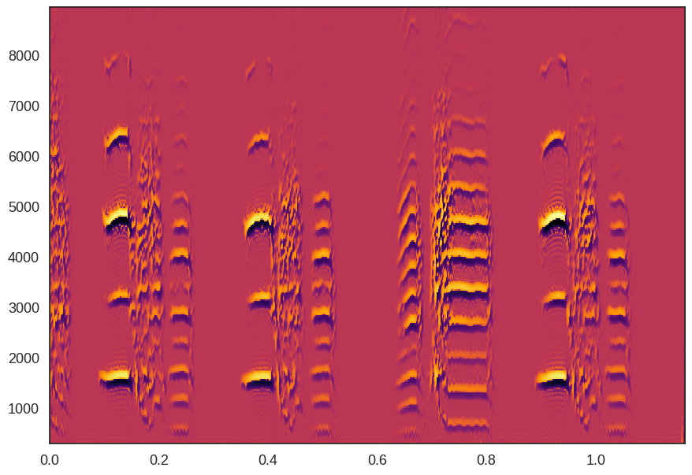

# Resin
Resin is a spectral analysis toolbox for Python inspired by [SAP](http://soundanalysispro.com/).

## Requirements
+ Python 2.7+
+ Numpy

Optional Requirements -- for simiplicity [Anaconda](https://www.continuum.io/downloads) in recomended.
+ Scipy
+ Matplotlib
+ Multitaper (requires libfftw3)

## Installation

```bash
git clone https://github.com/kylerbrown/resin
cd resin
pip install .
```
## Usage example

```python
from resin import Spectrum
spect = Spectrum(data, sampling_rate)
spect.spectrogram(freq_range=(300, 90000))
```



## Authors
Resin is released under the Gnu Public License by Kyler Brown, 2017.

Resin is a fork of `segmentation` by Mike Lusignan.

Mike Lusignan wrote `segmentation` as part of his PhD thesis. Details of the algorithms can be found in: 
Lusignan, M. E. University of Chicago. (2012). [_Growing up singing: Behavioral and physiological perspectives on song acquisition_]( http://pi.lib.uchicago.edu/1001/cat/bib/9370223).

