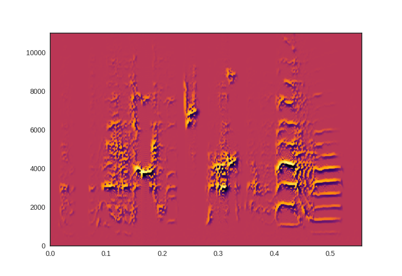
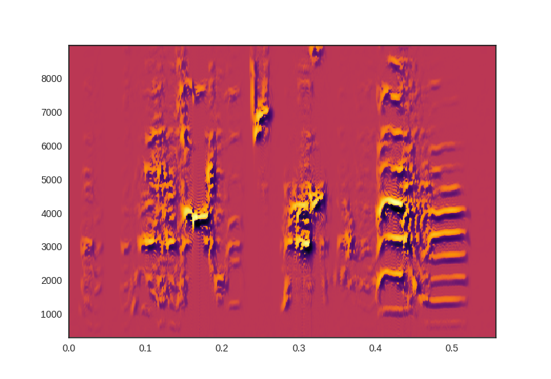

# Resin
Resin is a spectral analysis toolbox for Python inspired by [SAP](http://soundanalysispro.com/).

## Requirements
+ Python 2.7+
+ Numpy

Optional Requirements
+ Scipy
+ Matplotlib

## Installation

```bash
git clone https://github.com/kylerbrown/resin
cd resin
pip install .
```
## Usage example

The folder `examples` contains some example usage.

```python
# loading in the data
sr, data = wavfile.read('black33.wav')
# create a Spectra object using SAP-like defaults
spa = resin.sap_spectra(sr)
spa.signal(data)
spa.spectrogram()
```



```python
# Alternately, customize the mutli-taper parameters
# by creating a Spectra object directly.

spa2 = resin.Spectra(sr, 
                    NFFT=1024, 
                    noverlap=1000, 
                    data_window=int(0.01 * sr), 
                    n_tapers=3, 
                    NW=1.8,
                    freq_range=(300, 9000))
spa2.signal(data)
spa2.spectrogram()
```


## Tips for speed

+ Install scipy, which allows `resin` to use a faster fft library than the numpy default. In my experience, scipy's fft is about 40% faster than numpy's, even when using the Anaconda MKL FFT.
+ Use an NFFT equal to a power of 2 (512, 1024, etc.)

## Authors

Mike Lusignan wrote `segmentation` as part of his PhD thesis. Details of the algorithms can be found in: 
Lusignan, M. E. University of Chicago. (2012). [_Growing up singing: Behavioral and physiological perspectives on song acquisition_]( http://pi.lib.uchicago.edu/1001/cat/bib/9370223).

Resin is a fork of `segmentation`, writen by Kyler Brown, 2017.

